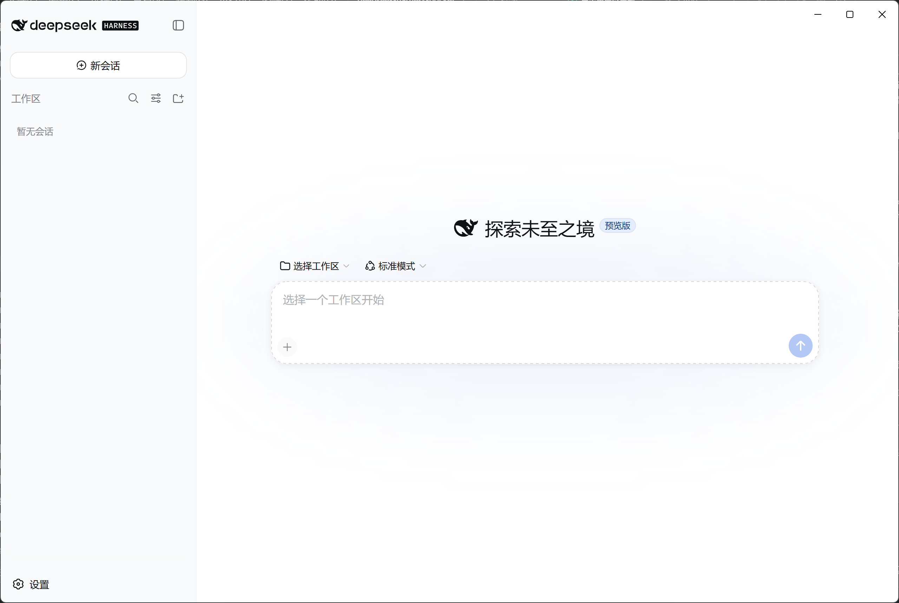
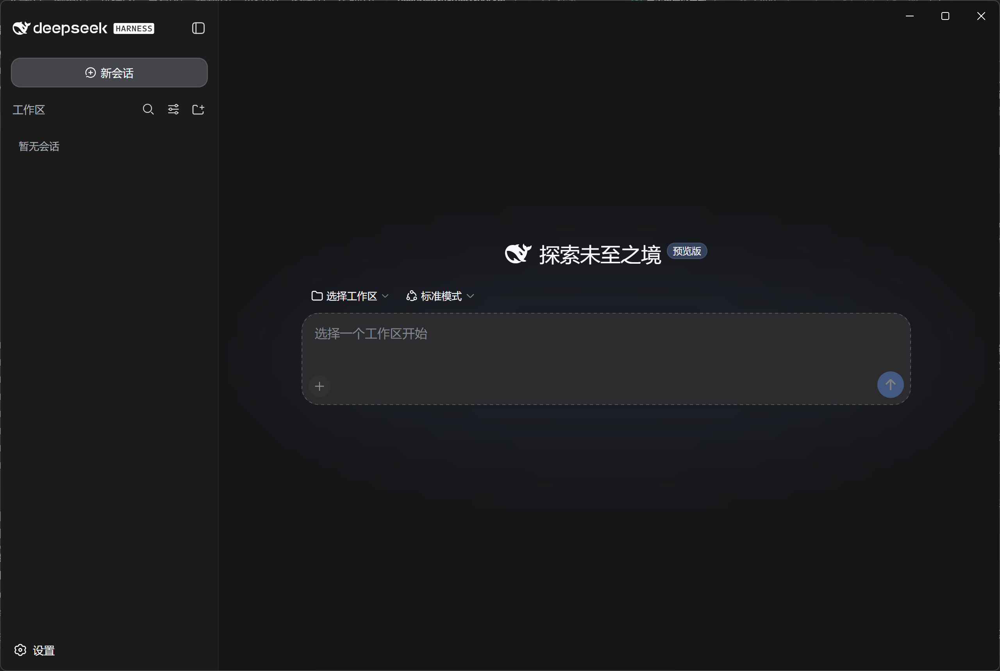

# DeepSeek Harness Desktop

DeepSeek Harness Web 界面的桌面客户端（跨平台）。

## 项目简介

DeepSeek Harness 是 DeepSeek 官方的 Agent 开发框架，原版通过命令行 `npx @deepseek-ai/dsh web` 启动服务后在浏览器访问。本项目用 Electron 把它封装成桌面应用：

- 双击即用：自动拉起本机 dsh 服务，界面内嵌在应用窗口中，无需命令行、浏览器或安装 Node.js
- 关闭窗口最小化到系统托盘，服务在后台继续运行；托盘菜单可恢复窗口或退出
- 标题栏颜色跟随界面主题（浅色/深色/跟随系统）
- 自定义图标、标题，隐藏 Electron 默认菜单栏
- 修复 Windows 目录选择崩溃：自动切换为内置浏览面板，无需原生对话框
- 对话界面顶部优化：28px 窗口拖动条、恢复原生窗口按钮、隐藏导出按钮
- 插件管理：支持 npm 包名 / Git 地址 / 本地路径安装
- 跨平台：Windows / macOS / Linux

## 界面预览





## 安装

| 平台 | 文件 |
|---|---|
| Windows | `DSH Desktop Setup 0.3.0.exe`（安装版）/ `DSH Desktop-0.3.0-win-x64.zip`（免安装，解压即用） |
| macOS (Apple Silicon) | `DSH Desktop-0.3.0-arm64.dmg` |
| Linux | `DSH Desktop-0.3.0.AppImage` |

> macOS 版本未签名，首次打开请右键选择"打开"；Linux 需先 `chmod +x "DSH Desktop-0.3.0.AppImage"`。

每个发布产物均附带同名 `.sha256` 校验文件（由构建流水线自动生成），可用于校验下载完整性：

```bash
# Windows (PowerShell)
Get-FileHash "DSH Desktop Setup 0.3.0.exe" -Algorithm SHA256

# macOS / Linux
shasum -a 256 "DSH Desktop-0.3.0.dmg"
# 将输出与 .sha256 文件内容比对
```

## 首次使用

1. 打开应用，等待服务就绪后自动进入 Harness 界面
2. 配置 API Key：设置环境变量 `DEEPSEEK_API_KEY`，或编辑 `~/.dsh/settings.yaml`
3. 在输入框开始对话

## 开发

```bash
cd desktop-app
npm install        # 安装依赖
npm start          # 开发模式运行
npm run dist       # 打包当前平台安装包
```

## 多平台构建

本仓库通过 GitHub Actions 矩阵构建三平台产物（`.github/workflows/build.yml`）：

- 手动触发：Actions 页面 Run workflow
- 打 tag 自动触发：`git tag v0.3.0 && git push origin v0.3.0`

构建流水线为每个产物（exe / dmg / AppImage / zip）生成同名 `.sha256` 校验文件并随产物一起上传；Windows 打包不包含 unpacked 目录内容。

## 技术栈

- Electron 35 + Node.js 22
- DeepSeek Harness（@deepseek-ai/dsh）
