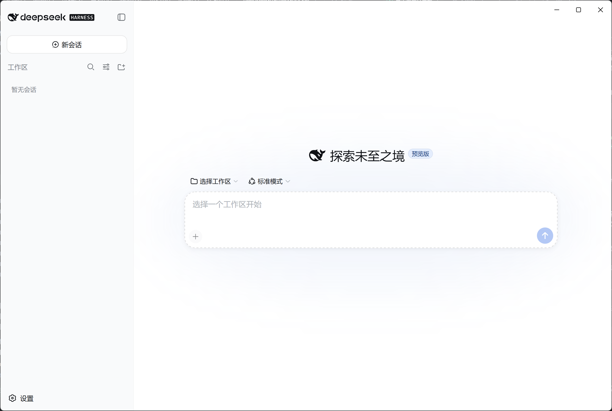
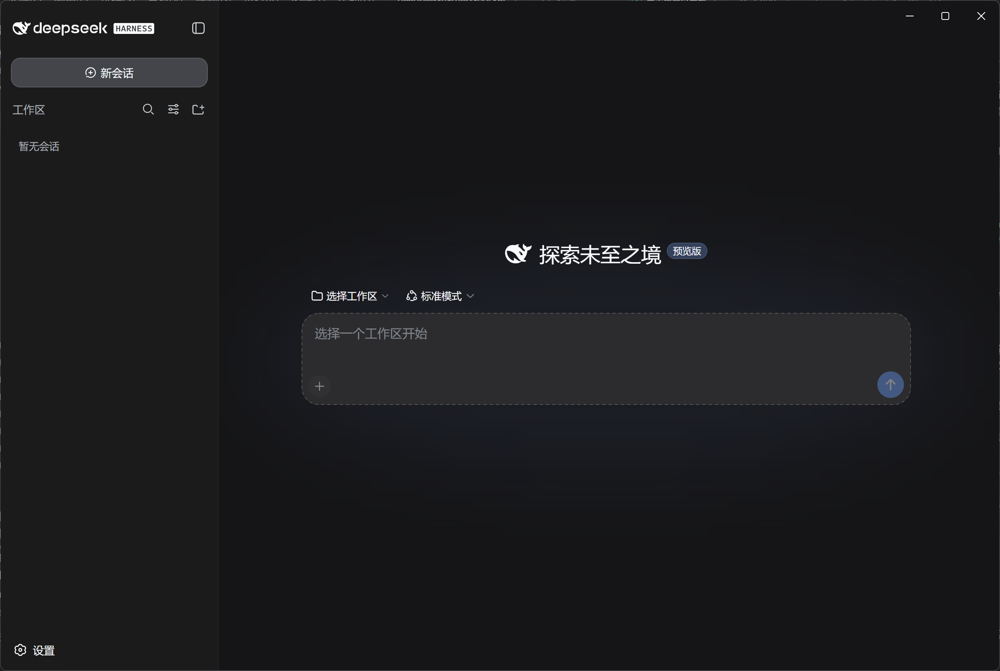

# DeepSeek Harness Desktop

DeepSeek Harness Web 界面的桌面客户端（跨平台）。

## 项目简介

DeepSeek Harness 是 DeepSeek 官方的 Agent 开发框架，原版通过命令行 `npx @deepseek-ai/dsh web` 启动服务后在浏览器访问。本项目用 Electron 把它封装成桌面应用：

- 双击即用：自动拉起本机 dsh 服务，界面内嵌在应用窗口中，无需命令行、浏览器或安装 Node.js
- 关闭窗口最小化到系统托盘，服务在后台继续运行；托盘菜单可恢复窗口或退出
- 标题栏颜色跟随界面主题（浅色/深色/跟随系统）
- 自定义图标、标题，隐藏 Electron 默认菜单栏
- 修复 Windows 目录选择崩溃：自动切换为内置浏览面板，无需原生对话框
- 对话界面顶部优化：28px 窗口拖动条、恢复原生窗口按钮、隐藏导出按钮
- 插件管理：支持 npm 包名 / Git 地址 / 本地路径安装
- 内核对齐上游：内置 DeepSeek Harness 0.1.7（回合导航轨道、侧边栏终端、Office/PDF 预览等）
- 跨平台：Windows / macOS / Linux

## 界面预览





## 安装

| 平台 | 文件 |
|---|---|
| Windows | `DSH Desktop Setup 0.5.0.exe`（安装版）/ `DSH Desktop-0.5.0-win-x64.zip`（免安装，解压即用） |
| macOS (Apple Silicon) | `DSH Desktop-0.5.0-arm64.dmg` |
| Linux | `DSH Desktop-0.5.0.AppImage` |

> macOS 版本未签名，首次打开请右键选择"打开"；Linux 需先 `chmod +x "DSH Desktop-0.5.0.AppImage"`。

每个发布产物均附带同名 `.sha256` 校验文件（由构建流水线自动生成），可用于校验下载完整性：

```bash
# Windows (PowerShell)
Get-FileHash "DSH Desktop Setup 0.5.0.exe" -Algorithm SHA256

# macOS / Linux
shasum -a 256 "DSH Desktop-0.5.0.dmg"
# 将输出与 .sha256 文件内容比对
```

## 首次使用

1. 打开应用，等待服务就绪后自动进入 Harness 界面
2. 配置 API Key：设置环境变量 `DEEPSEEK_API_KEY`，或在设置页的模型配置中添加提供商
3. 在输入框开始对话

## 开发

```bash
cd desktop-app
npm install        # 安装依赖
npm start          # 开发模式运行
npm run dist       # 打包当前平台安装包
```

## 多平台构建

本仓库通过 GitHub Actions 矩阵构建三平台产物（`.github/workflows/build.yml`）：

- 手动触发：Actions 页面 Run workflow
- 打 tag 自动触发：`git tag v0.5.0 && git push origin v0.5.0`

构建流水线为每个产物（exe / dmg / AppImage / zip）生成同名 `.sha256` 校验文件并随产物一起上传；Windows 打包不包含 unpacked 目录内容。

## 技术栈

- Electron 44.0.0 + Node.js 24
- DeepSeek Harness（@deepseek-ai/dsh 0.1.7-rc.2）

> **Electron 必须钉死在 `44.0.0`（或 `43.0.0`），不要用 `^` 或升级补丁版本。**
> dsh 的 `node-addon-require-builtin` 按 V8 指纹白名单校验宿主运行时，
> 仅接受 Electron 43.0.0 / 44.0.0 / 45.0.0-alpha.6，其他版本会在启动时报
> `unsupported Electron runtime fingerprint`。同理 dsh 家族包也需整组同版本升级。

> **打包必须带上 `node_modules/@deepseek-ai` 全量**（见 `build.extraResources`）。
> dsh 家族里大量包只通过 `peerDependencies` 互相引用，lockfile 中标记为 `peer: true`；
> electron-builder 收集生产依赖时会跳过这类条目，导致装出来的应用启动即报一串
> `failed to import` / `ERR_MODULE_NOT_FOUND`（0.1.7 升级时就踩了这个）。
> 由于 `files` 的通配符会被依赖树裁剪覆盖、不生效，这里改用 `extraResources` 把整个
> `@deepseek-ai` scope 叠加进 `resources/app/node_modules`；该做法依赖 `asar: false`。
> 上游每新增一个 peer-only 包都会重新触发该问题，这一条不要删。
